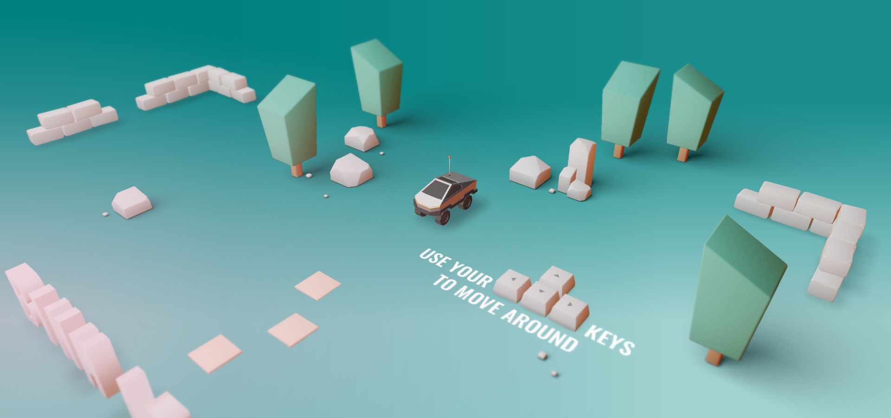

<!-- ABOUT THE PROJECT -->
## About The Project

<a href="#">
    
</a>


Credited to:    
1-<b style="font-size: 40px;"> Bruno Simon</b> for his astonishing work and instructions.  
2-<b style="font-size: 40px;"> HASSAN ZAYED</b>'s amazing 3d beautiful Istanbul design.


### Built With

Frameworks/libraries used to bootstrap this project.

* [Three.js](https://nextjs.org/)
* [Blender](https://www.blender.org/)


<!-- GETTING STARTED -->
## Getting Started

To get a local copy up and running follow these simple example steps.


### Scripts

1. Clone the repo
   ```sh
   git clone https://github.com/mosab7/portfolio-main
   ```
2. Install NPM packages
   ```sh
   npm install
   ```
3. Run locally
   ```sh
   npm run dev
   ```
4. Build production version
   ```sh
   npm run build
   ```

